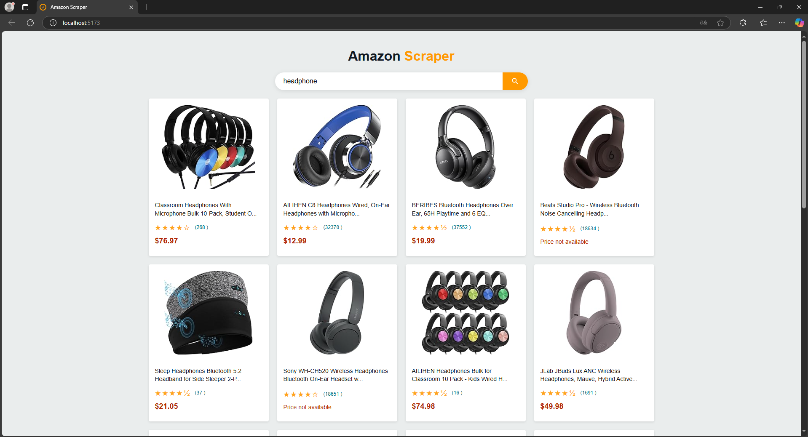

# 🔍 Amazon Product Scraper


A high-performance Amazon product scraper with modern JavaScript stack.



## 🌟 Features

| Feature | Description |
|---------|-------------|
| **Lightning Fast** | Bun runtime for backend operations |
| **Modern Frontend** | Vite-powered vanilla JS |
| **Real-time Data** | Live Amazon product scraping |
| **Polite Scraper** | Built-in rate limiting |
| **Clean UI** | Responsive product cards |

## 🧩 Tech Stack

**Backend**
- Runtime: [Bun](https://bun.sh/) (v1.0)
- Server: Express
- Scraping: JSDOM + Axios
- Middleware: CORS

**Frontend**
- Builder: [Vite](https://vitejs.dev/) (v5.0)
- Core: Vanilla JavaScript (ES6+)
- Styling: CSS3 (Flexbox/Grid)

## 🛠 Setup Guide

### Prerequisites

Before you begin, ensure you have installed:

1. [Node.js](https://nodejs.org/) (v18 or higher)
2. [Bun](https://bun.sh/) (optional but recommended for backend)
3. [Git](https://git-scm.com/) (for cloning the repository)

### Installation

```bash
# Clone the repository
git clone https://github.com/JackNoArms/amazon-scraper.git
cd amazon-scraper
```

### Backend (Bun)

```bash
# Navigate to backend folder
cd backend

# Install dependencies (using Bun or npm)
bun install
# OR
npm install

# Start the server
bun run index.js
# OR if using Node
node index.js
```

### Frontend (Vite)

```bash
# Navigate to frontend folder
cd frontend

# Install dependencies
npm install

# Start the development server
npm run dev
```

## 📂 Directory Structure

```
amazon-scraper/
├── backend/
│   ├── src/
│   │   ├── config/          # Configuration files
│   │   ├── domain/          # Core business logic
│   │   │   ├── entities/    # Domain models
│   │   │   └── useCases/    # Business rules
│   │   ├── infrastructure/  # External services
│   │   │   ├── http/        # HTTP clients
│   │   │   └── parsers/     # Data parsers
│   │   ├── interfaces/      # Delivery mechanisms
│   │   │   ├── controllers/ # Route handlers
│   │   │   ├── repositories # Data access
│   │   │   └── presentation/
│   │   │       ├── routes/  # API endpoints
│   │   │       └── server.ts# Express server
│   │   └── shared/          # Common utilities
│   │       ├── errors/      # Custom errors
│   │       └── utils/       # Helper functions
│   └── tsconfig.json        # TypeScript config
├── frontend/
│   ├── src/
│   │   ├── core/
│   │   │   └── api/
│   │   │       └── ApiClient.js # API Service
│   │   ├── components/      # UI components
│   │   └── pages/           # Application views
│   └── vite.config.js
└── README.md
```

## ⚙️ Configuration

Create `.env` file in backend:

```ini
PORT=3000
REQUEST_DELAY=2000 # milliseconds between requests
MAX_RETRIES=3      # failed request attempts
USER_AGENT=Mozilla/5.0 # browser impersonation
```

## 🚦 Running the Project

**Backend Server**
```bash
bun run backend/server.js
```

**Frontend Development**
```bash
cd frontend
npm run dev
```

## 📡 API Reference

```http
GET /api/scrape?keyword={searchTerm}
```

**Response Example**
```json
{
  "products": [
    {
      "title": "Wireless Earbuds",
      "price": "$29.99",
      "rating": 4.5,
      "imageUrl": "...",
      "isPrime": true
    }
  ]
}
```

## 🚨 Important Notes

- This project requires Node.js v18+ or Bun runtime
- Amazon may block scrapers - use responsibly
- Add proper error handling for production use
- Consider rotating User-Agents and proxies

## 🤝 How to Contribute

1. Fork the repository
2. Create a feature branch (`git checkout -b feature/improvement`)
3. Commit changes (`git commit -m 'Add new feature'`)
4. Push to branch (`git push origin feature/improvement`)
5. Open a Pull Request

## 📜 License

MIT License © 2024 [JackNoArms](https://github.com/JackNoArms)

---

> **Note**: This project is for educational purposes only. Always comply with Amazon's Terms of Service.